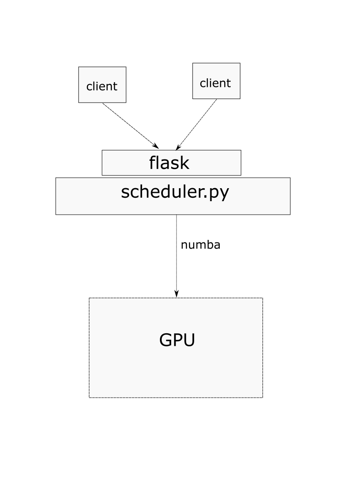

# Documentation for imprecise scheduling

## Current Scheduling framework architecture

A client makes an HTTP request, where it sends the following
- Path to workload
- Priority
- Deadline
- Minimum precision required
- A function to determine precision from time

After recieving requests from a client, the scheduler will use our scheduling algorithm to find the best way to send workloads to the GPU. 
For right now it will send matricies through numba to the GPU. 
